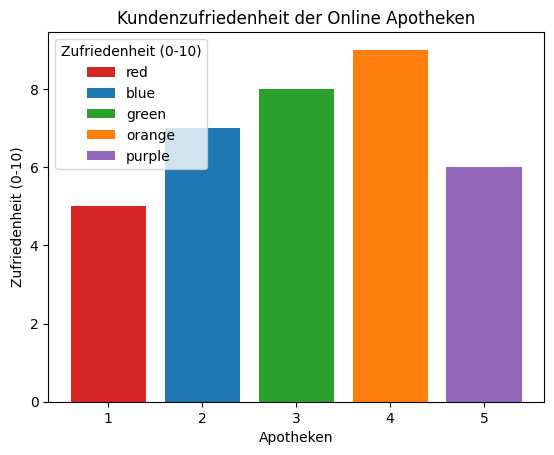
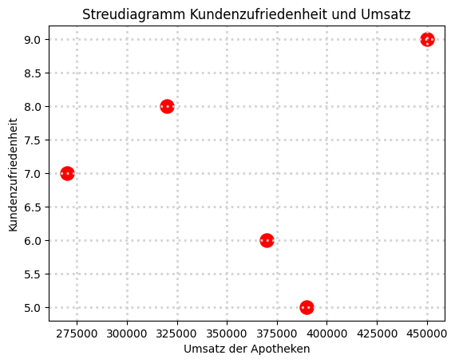
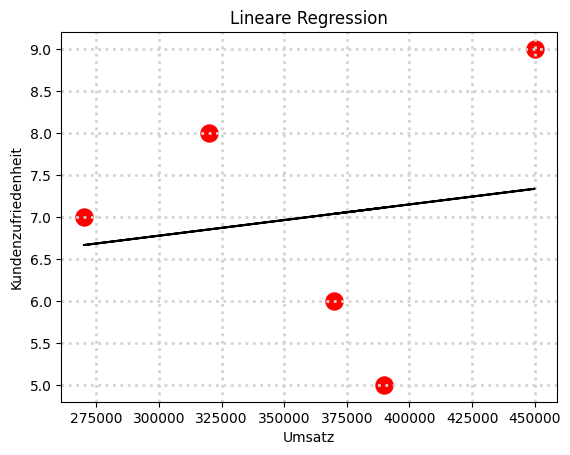
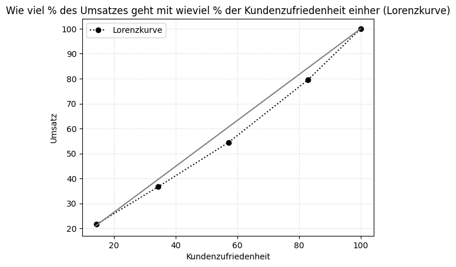

# Bivariante Analyse am Beispiel von Online Apotheken
### Für 5 Online Apotheken wird der Umsatz und die Kundenzufriedenheit untersucht.
#### Frage: Steigt der Umsatz bei einer höheren Kundenzufriedenheit?


```python
import numpy as np
import matplotlib.pyplot as plt
import pandas as pd
from sklearn.linear_model import LinearRegression
```


```python
df = pd.DataFrame ({'Apotheken': ['1', '2','3','4','5'],
                    'Umsatz': [390000, 270000, 320000, 450000, 370000],
                    'Kundenzufriedenheit (0-10)': [5,7,8,9,6]})
```


```python
df
```


<div>
<style scoped>
    .dataframe tbody tr th:only-of-type {
        vertical-align: middle;
    }

    .dataframe tbody tr th {
        vertical-align: top;
    }

    .dataframe thead th {
        text-align: right;
    }
</style>
<table border="1" class="dataframe">
  <thead>
    <tr style="text-align: right;">
      <th></th>
      <th>Apotheken</th>
      <th>Umsatz</th>
      <th>Kundenzufriedenheit (0-10)</th>
    </tr>
  </thead>
  <tbody>
    <tr>
      <th>0</th>
      <td>1</td>
      <td>390000</td>
      <td>5</td>
    </tr>
    <tr>
      <th>1</th>
      <td>2</td>
      <td>270000</td>
      <td>7</td>
    </tr>
    <tr>
      <th>2</th>
      <td>3</td>
      <td>320000</td>
      <td>8</td>
    </tr>
    <tr>
      <th>3</th>
      <td>4</td>
      <td>450000</td>
      <td>9</td>
    </tr>
    <tr>
      <th>4</th>
      <td>5</td>
      <td>370000</td>
      <td>6</td>
    </tr>
  </tbody>
</table>
</div>


```python
pd.pivot_table(df, values='Kundenzufriedenheit (0-10)', index=['Umsatz'], columns=['Apotheken'], aggfunc='sum', margins=True, margins_name='Sum')
```


<div>
<style scoped>
    .dataframe tbody tr th:only-of-type {
        vertical-align: middle;
    }

    .dataframe tbody tr th {
        vertical-align: top;
    }

    .dataframe thead th {
        text-align: right;
    }
</style>
<table border="1" class="dataframe">
  <thead>
    <tr style="text-align: right;">
      <th>Apotheken</th>
      <th>1</th>
      <th>2</th>
      <th>3</th>
      <th>4</th>
      <th>5</th>
      <th>Sum</th>
    </tr>
    <tr>
      <th>Umsatz</th>
      <th></th>
      <th></th>
      <th></th>
      <th></th>
      <th></th>
      <th></th>
    </tr>
  </thead>
  <tbody>
    <tr>
      <th>270000</th>
      <td>NaN</td>
      <td>7.0</td>
      <td>NaN</td>
      <td>NaN</td>
      <td>NaN</td>
      <td>7</td>
    </tr>
    <tr>
      <th>320000</th>
      <td>NaN</td>
      <td>NaN</td>
      <td>8.0</td>
      <td>NaN</td>
      <td>NaN</td>
      <td>8</td>
    </tr>
    <tr>
      <th>370000</th>
      <td>NaN</td>
      <td>NaN</td>
      <td>NaN</td>
      <td>NaN</td>
      <td>6.0</td>
      <td>6</td>
    </tr>
    <tr>
      <th>390000</th>
      <td>5.0</td>
      <td>NaN</td>
      <td>NaN</td>
      <td>NaN</td>
      <td>NaN</td>
      <td>5</td>
    </tr>
    <tr>
      <th>450000</th>
      <td>NaN</td>
      <td>NaN</td>
      <td>NaN</td>
      <td>9.0</td>
      <td>NaN</td>
      <td>9</td>
    </tr>
    <tr>
      <th>Sum</th>
      <td>5.0</td>
      <td>7.0</td>
      <td>8.0</td>
      <td>9.0</td>
      <td>6.0</td>
      <td>35</td>
    </tr>
  </tbody>
</table>
</div>


```python
fig, ax = plt.subplots()

apotheken = df['Apotheken']
zufriedenheit = df['Kundenzufriedenheit (0-10)']
bar_labels = ['red', 'blue', 'green', 'orange','purple']
bar_colors = ['tab:red', 'tab:blue', 'tab:green', 'tab:orange', 'tab:purple']

ax.bar(apotheken, zufriedenheit, label=bar_labels, color=bar_colors)

ax.set_ylabel('Zufriedenheit (0-10)')
ax.set_xlabel('Apotheken')
ax.set_title('Kundenzufriedenheit der Online Apotheken')
ax.legend(title='Zufriedenheit (0-10)')

plt.show()
```


    

    


```python
x = df['Umsatz']
y = df['Kundenzufriedenheit (0-10)']

plt.scatter(x, y, s=150, c='r')
plt.xlabel('Umsatz der Apotheken')
plt.ylabel('Kundenzufriedenheit')
plt.title('Streudiagramm Kundenzufriedenheit und Umsatz')
plt.grid(color='lightgrey', linestyle='dotted', linewidth=2)
plt.show()
```


    

    


```python
X = df['Umsatz'].values.reshape(-1, 1)
y = df['Kundenzufriedenheit (0-10)']
regressor = LinearRegression()
regressor.fit(X, y)
```


<style>#sk-container-id-1 {color: black;background-color: white;}#sk-container-id-1 pre{padding: 0;}#sk-container-id-1 div.sk-toggleable {background-color: white;}#sk-container-id-1 label.sk-toggleable__label {cursor: pointer;display: block;width: 100%;margin-bottom: 0;padding: 0.3em;box-sizing: border-box;text-align: center;}#sk-container-id-1 label.sk-toggleable__label-arrow:before {content: "▸";float: left;margin-right: 0.25em;color: #696969;}#sk-container-id-1 label.sk-toggleable__label-arrow:hover:before {color: black;}#sk-container-id-1 div.sk-estimator:hover label.sk-toggleable__label-arrow:before {color: black;}#sk-container-id-1 div.sk-toggleable__content {max-height: 0;max-width: 0;overflow: hidden;text-align: left;background-color: #f0f8ff;}#sk-container-id-1 div.sk-toggleable__content pre {margin: 0.2em;color: black;border-radius: 0.25em;background-color: #f0f8ff;}#sk-container-id-1 input.sk-toggleable__control:checked~div.sk-toggleable__content {max-height: 200px;max-width: 100%;overflow: auto;}#sk-container-id-1 input.sk-toggleable__control:checked~label.sk-toggleable__label-arrow:before {content: "▾";}#sk-container-id-1 div.sk-estimator input.sk-toggleable__control:checked~label.sk-toggleable__label {background-color: #d4ebff;}#sk-container-id-1 div.sk-label input.sk-toggleable__control:checked~label.sk-toggleable__label {background-color: #d4ebff;}#sk-container-id-1 input.sk-hidden--visually {border: 0;clip: rect(1px 1px 1px 1px);clip: rect(1px, 1px, 1px, 1px);height: 1px;margin: -1px;overflow: hidden;padding: 0;position: absolute;width: 1px;}#sk-container-id-1 div.sk-estimator {font-family: monospace;background-color: #f0f8ff;border: 1px dotted black;border-radius: 0.25em;box-sizing: border-box;margin-bottom: 0.5em;}#sk-container-id-1 div.sk-estimator:hover {background-color: #d4ebff;}#sk-container-id-1 div.sk-parallel-item::after {content: "";width: 100%;border-bottom: 1px solid gray;flex-grow: 1;}#sk-container-id-1 div.sk-label:hover label.sk-toggleable__label {background-color: #d4ebff;}#sk-container-id-1 div.sk-serial::before {content: "";position: absolute;border-left: 1px solid gray;box-sizing: border-box;top: 0;bottom: 0;left: 50%;z-index: 0;}#sk-container-id-1 div.sk-serial {display: flex;flex-direction: column;align-items: center;background-color: white;padding-right: 0.2em;padding-left: 0.2em;position: relative;}#sk-container-id-1 div.sk-item {position: relative;z-index: 1;}#sk-container-id-1 div.sk-parallel {display: flex;align-items: stretch;justify-content: center;background-color: white;position: relative;}#sk-container-id-1 div.sk-item::before, #sk-container-id-1 div.sk-parallel-item::before {content: "";position: absolute;border-left: 1px solid gray;box-sizing: border-box;top: 0;bottom: 0;left: 50%;z-index: -1;}#sk-container-id-1 div.sk-parallel-item {display: flex;flex-direction: column;z-index: 1;position: relative;background-color: white;}#sk-container-id-1 div.sk-parallel-item:first-child::after {align-self: flex-end;width: 50%;}#sk-container-id-1 div.sk-parallel-item:last-child::after {align-self: flex-start;width: 50%;}#sk-container-id-1 div.sk-parallel-item:only-child::after {width: 0;}#sk-container-id-1 div.sk-dashed-wrapped {border: 1px dashed gray;margin: 0 0.4em 0.5em 0.4em;box-sizing: border-box;padding-bottom: 0.4em;background-color: white;}#sk-container-id-1 div.sk-label label {font-family: monospace;font-weight: bold;display: inline-block;line-height: 1.2em;}#sk-container-id-1 div.sk-label-container {text-align: center;}#sk-container-id-1 div.sk-container {/* jupyter's `normalize.less` sets `[hidden] { display: none; }` but bootstrap.min.css set `[hidden] { display: none !important; }` so we also need the `!important` here to be able to override the default hidden behavior on the sphinx rendered scikit-learn.org. See: https://github.com/scikit-learn/scikit-learn/issues/21755 */display: inline-block !important;position: relative;}#sk-container-id-1 div.sk-text-repr-fallback {display: none;}</style><div id="sk-container-id-1" class="sk-top-container"><div class="sk-text-repr-fallback"><pre>LinearRegression()</pre><b>In a Jupyter environment, please rerun this cell to show the HTML representation or trust the notebook. <br />On GitHub, the HTML representation is unable to render, please try loading this page with nbviewer.org.</b></div><div class="sk-container" hidden><div class="sk-item"><div class="sk-estimator sk-toggleable"><input class="sk-toggleable__control sk-hidden--visually" id="sk-estimator-id-1" type="checkbox" checked><label for="sk-estimator-id-1" class="sk-toggleable__label sk-toggleable__label-arrow">LinearRegression</label><div class="sk-toggleable__content"><pre>LinearRegression()</pre></div></div></div></div></div>


##### Es besteht eine positive Korrelation. Somit steigt der Umsatz bei einer höheren Kundenzufriedenheit an.


```python
plt.scatter(X, y, color = 'red', s=150)
plt.plot(X, regressor.predict(X), color = 'black')
plt.title('Lineare Regression')
plt.xlabel('Umsatz')
plt.ylabel('Kundenzufriedenheit')
plt.grid(color='lightgrey', linestyle='dotted', linewidth=2)
plt.show()
```


    

    


```python
df.corr(method= "pearson")
```


<div>
<style scoped>
    .dataframe tbody tr th:only-of-type {
        vertical-align: middle;
    }

    .dataframe tbody tr th {
        vertical-align: top;
    }

    .dataframe thead th {
        text-align: right;
    }
</style>
<table border="1" class="dataframe">
  <thead>
    <tr style="text-align: right;">
      <th></th>
      <th>Apotheken</th>
      <th>Umsatz</th>
      <th>Kundenzufriedenheit (0-10)</th>
    </tr>
  </thead>
  <tbody>
    <tr>
      <th>Apotheken</th>
      <td>1.000000</td>
      <td>0.322886</td>
      <td>0.400000</td>
    </tr>
    <tr>
      <th>Umsatz</th>
      <td>0.322886</td>
      <td>1.000000</td>
      <td>0.161443</td>
    </tr>
    <tr>
      <th>Kundenzufriedenheit (0-10)</th>
      <td>0.400000</td>
      <td>0.161443</td>
      <td>1.000000</td>
    </tr>
  </tbody>
</table>
</div>


```python
df.corr(method= "spearman")
```


<div>
<style scoped>
    .dataframe tbody tr th:only-of-type {
        vertical-align: middle;
    }

    .dataframe tbody tr th {
        vertical-align: top;
    }

    .dataframe thead th {
        text-align: right;
    }
</style>
<table border="1" class="dataframe">
  <thead>
    <tr style="text-align: right;">
      <th></th>
      <th>Apotheken</th>
      <th>Umsatz</th>
      <th>Kundenzufriedenheit (0-10)</th>
    </tr>
  </thead>
  <tbody>
    <tr>
      <th>Apotheken</th>
      <td>1.0</td>
      <td>0.2</td>
      <td>0.4</td>
    </tr>
    <tr>
      <th>Umsatz</th>
      <td>0.2</td>
      <td>1.0</td>
      <td>0.1</td>
    </tr>
    <tr>
      <th>Kundenzufriedenheit (0-10)</th>
      <td>0.4</td>
      <td>0.1</td>
      <td>1.0</td>
    </tr>
  </tbody>
</table>
</div>


```python
df['Relative Häufigkeit'] = df['Kundenzufriedenheit (0-10)'] / df['Kundenzufriedenheit (0-10)'].sum()
df.head()
```


<div>
<style scoped>
    .dataframe tbody tr th:only-of-type {
        vertical-align: middle;
    }

    .dataframe tbody tr th {
        vertical-align: top;
    }

    .dataframe thead th {
        text-align: right;
    }
</style>
<table border="1" class="dataframe">
  <thead>
    <tr style="text-align: right;">
      <th></th>
      <th>Apotheken</th>
      <th>Umsatz</th>
      <th>Kundenzufriedenheit (0-10)</th>
      <th>Relative Häufigkeit</th>
    </tr>
  </thead>
  <tbody>
    <tr>
      <th>0</th>
      <td>1</td>
      <td>390000</td>
      <td>5</td>
      <td>0.142857</td>
    </tr>
    <tr>
      <th>1</th>
      <td>2</td>
      <td>270000</td>
      <td>7</td>
      <td>0.200000</td>
    </tr>
    <tr>
      <th>2</th>
      <td>3</td>
      <td>320000</td>
      <td>8</td>
      <td>0.228571</td>
    </tr>
    <tr>
      <th>3</th>
      <td>4</td>
      <td>450000</td>
      <td>9</td>
      <td>0.257143</td>
    </tr>
    <tr>
      <th>4</th>
      <td>5</td>
      <td>370000</td>
      <td>6</td>
      <td>0.171429</td>
    </tr>
  </tbody>
</table>
</div>


```python
rel_k = df['Kundenzufriedenheit (0-10)'] / df['Kundenzufriedenheit (0-10)'].sum() * 100
x_k = rel_k.cumsum()
rel_u = df['Umsatz'] / df['Umsatz'].sum()
y_p = rel_u.cumsum() * 100
plt.plot(x_k, y_p,color='black',marker="o", linestyle="dotted", label='Lorenzkurve')
plt.xlabel("Kundenzufriedenheit")
plt.ylabel("Umsatz")
plt.title("Wie viel % des Umsatzes geht mit wieviel % der Kundenzufriedenheit einher (Lorenzkurve)")
plt.grid(color="#CCCCCC", linestyle="dotted")
x = [14,100]
y = [21,100]
plt.plot(x, y, color="grey")
plt.legend()
plt.grid(color="#CCCCCC", linestyle="dotted")
plt.show()
```


    

    


```python
t1 = ((0 + df['Relative Häufigkeit'][0] / 2)) * 0.2
t2 = ((df['Relative Häufigkeit'][0] + df['Relative Häufigkeit'][1]) / 2) * 0.2
t3 = ((df['Relative Häufigkeit'][1] + df['Relative Häufigkeit'][2]) / 2) * 0.2
t4 = ((df['Relative Häufigkeit'][2] + df['Relative Häufigkeit'][3]) / 2) * 0.2
t5 = ((df['Relative Häufigkeit'][3] + 1) / 2) * 0.2
summe = t1 + t2 + t3 + t4 + t5
abstand = 0.5 - summe
gini = int(abstand / 0.5 * 100)
print("Gini Koeffizient: ", gini, "%")
```

    Gini Koeffizient:  46 %

